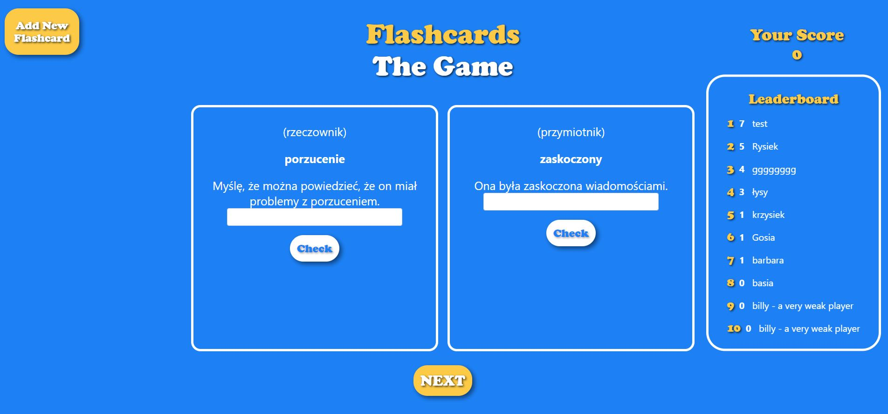

# **FLASHCARDS THE GAME APP**

An application for learning English with the help of the well-known flashcards. The user is the player who defeats successive vocabulary cards. Each round the player is shown two random cards. If the player guesses one card, he/she receives one point, if he/she guesses two cards, he/she receives three points, if he/she does not know any of the words, the game ends. If the player does not know any of the words, the game ends and the player (if the points obtained allow it) has the opportunity to write himself on the scoreboard. The project does not include a vocabulary database, but allows the user to create their own vocabulary using the big yellow button in the top left corner. 

---

## Table of Contents
* [General Info](#general-information)
* [Technologies Used](#technologies-used)
* [Screenshots](#screenshots)
* [Setup](#setup)

## General Information
The purpose of this project was to gain practical experience in building a fullstack application. This project provided an excellent opportunity to explore issues related to user interface design, application state management and the integration of different technologies.

## Technologies Used
- Node - version 20.10
- Express - version 4.18
- MongoDB - version 7.0
- React - version 18.2

## Screenshots

## Setup
You will need to download and install MongoDB to run the application. If you did not change the path during installation, you should be able to start MongoDB by typing in the terminal (necessarily in administrator mode) : `net start MongoDB`

Before working with the project, we need to download the required libraries. In order to do so, we should enter the following command in the directories where the `package.json` file is located: `npm install`

Then, in the main directory of the project, run the `index.js` file with the command: `node backend/index.js`  
You should receive a message in the console saying that the server is listening on port 9999

To run the frontend, open a new terminal and enter the `./frontend` directory. There, enter the command: `npm start`
