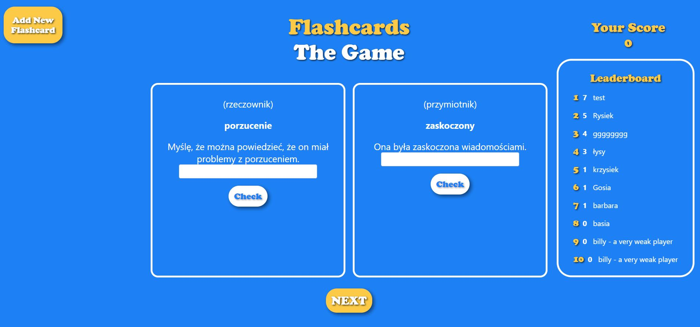

# FLASHCARDS APP

## OPIS PROJEKTU
 
    Aplikacja do nauki języka angielksiego przy pomocy dobrze znanych fiszek. Użytkownik jest graczem ,który pokonuje kolejne karty ze słowkami. W 
każdej rundzie graczowi wyświetlaja sie dwie losowe karty. Jeśli odgadnie jedną otrzyma jeden punkt, jeśli dwie otrzyma trzy punkty, jeśli zaś 
nie zna żadnego ze słów gra się kończy, a gracz (jeśli uzyskane punkty na to pozwolą) ma możliwość wpisania się na tablice wyników.  
    Projekt nie zawiera bazy słówek ,jednak daje możliwość tworzenia własnych przez użytkownika za pomocą wielkiego żółtego przycisku w lewym górnym 
rogu.     

/////////////////////////////////////////////
# flashcards app
api

11.02

uruchomienie serwera:
node index.js

uruchomienie bazy danych (w trybie administartora)
net start MongoDB

uruchomienie frontendu
npm start